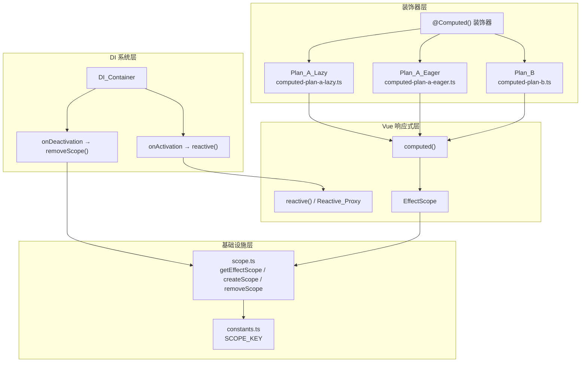
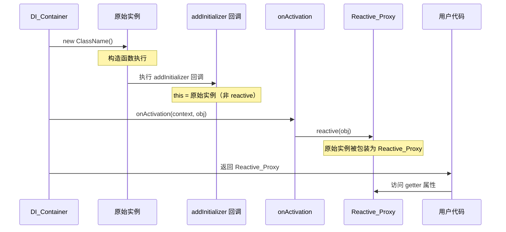
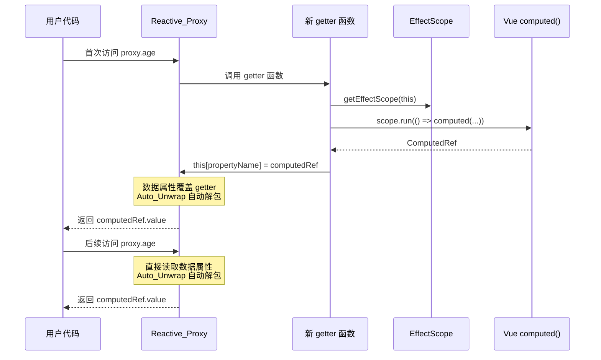
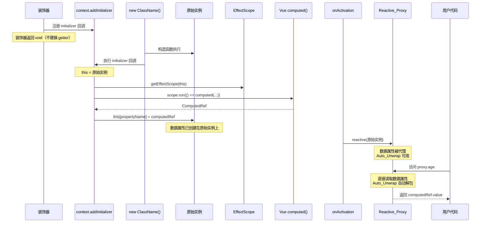
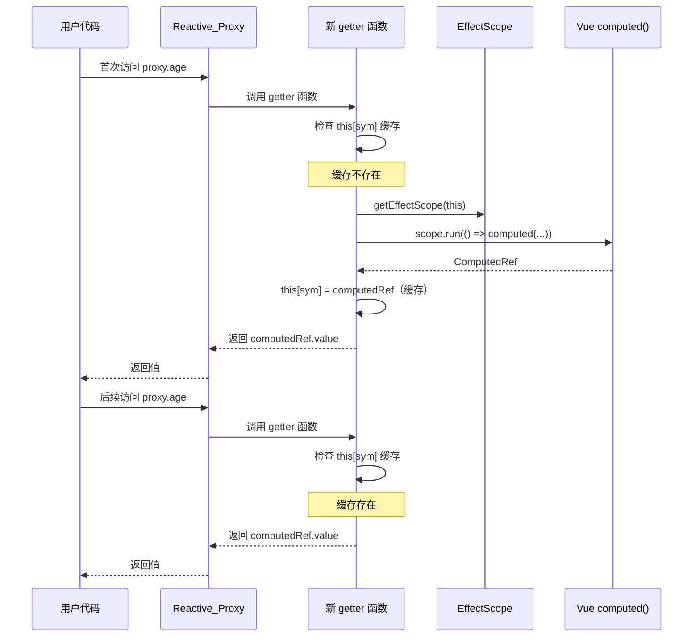
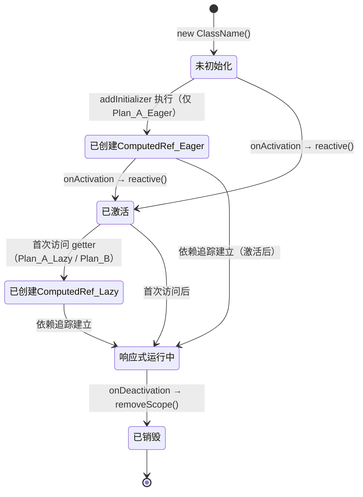

# 设计文档：@Computed 装饰器重新设计

## 概述

本设计文档描述了 `@Computed` 装饰器的重新设计方案。`@Computed` 装饰器基于 TC39 Stage 3 装饰器语法，用于将类的 getter 属性转换为 Vue `computed` 响应式计算属性。

设计目标是提供三种实现方案（Plan_A_Lazy、Plan_A_Eager、Plan_B），同时保留在项目中，并通过测试和文档对比各方案的优缺点。

### 核心设计决策

1. **只处理 getter 装饰器**：不处理 setter 和 accessor 装饰器，简化实现
2. **EffectScope 管理**：所有 `computed()` 调用必须在 `EffectScope.run` 中执行，确保副作用可被统一清理
3. **DI 系统集成**：DI 容器的 `onActivation` 钩子将实例转为 `reactive` 代理，装饰器需与此机制协同工作
4. **三种方案共存**：Plan_A_Lazy、Plan_A_Eager、Plan_B 分别存放在独立文件中

### 关键技术背景

- **DI 容器生命周期**：`_createInstance()`（触发 `new ClassName()`，此时 `addInitializer` 回调执行，`this` 是原始实例）→ `activate()`（通过 `onActivation` 钩子调用 `reactive()` 包装实例）
- **Vue reactive Auto_Unwrap**：在 `reactive` 代理对象上，如果某个数据属性的值是 `Ref`/`ComputedRef`，访问该属性时会自动返回 `.value`，无需手动解包。但此机制仅对数据属性生效，对 getter 属性不生效
- **TC39 Stage 3 getter 装饰器**：接收 `(value: Function, context: ClassGetterDecoratorContext)` 两个参数，可返回新的 getter 函数替换原始 getter，`context.addInitializer` 注册的回调在 `new ClassName()` 构造函数中执行

## 架构

### 整体架构图



### DI 容器实例生命周期



## 组件与接口

### 三种方案的实现策略

#### Plan_A_Lazy（方案一 — 懒创建策略）

**文件**：`src/computed-plan-a-lazy.ts`

**策略**：装饰器返回一个新的 getter 函数。当在 Reactive_Proxy 上首次访问该 getter 时，新 getter 函数内部在实例对象上创建一个与 getter 同名的 ComputedRef 数据属性，替代原始 getter 的访问路径。后续访问将直接读取该数据属性（通过 Auto_Unwrap 自动解包）。



**核心实现逻辑**：

```typescript
export function ComputedPlanALazy(): (
  value: (this: any) => any,
  context: ClassGetterDecoratorContext
) => (this: any) => any {
  return function (
    value: (this: any) => any,
    context: ClassGetterDecoratorContext
  ): (this: any) => any {
    const propertyName = context.name;
    return function (this: any): any {
      // this 在 Reactive_Proxy 上访问时已经是 reactive 代理
      const scope = getEffectScope(this);
      const originalGet = value;
      const computedRef = scope.run(() => computed(() => originalGet.call(this)));
      // 在实例上创建同名数据属性，覆盖 getter
      this[propertyName] = computedRef;
      // 首次返回值（Auto_Unwrap 会在后续访问中自动解包）
      return computedRef.value;
    };
  };
}
```

**关键点**：
- 新 getter 函数中，`this` 在 Reactive_Proxy 上访问时已经是 reactive 代理
- 通过 `this[propertyName] = computedRef` 在 reactive 代理上设置数据属性，该属性会覆盖原型链上的 getter
- 后续访问时，reactive 代理直接读取数据属性并通过 Auto_Unwrap 自动解包

#### Plan_A_Eager（方案一 — 提前创建策略）

**文件**：`src/computed-plan-a-eager.ts`

**策略**：在装饰器执行阶段，通过 `context.addInitializer` 注册回调。回调在 `new ClassName()` 构造函数中执行，此时 `this` 是原始实例（非 reactive）。在回调中创建 ComputedRef 并赋值为同名数据属性。



**核心实现逻辑**：

```typescript
export function ComputedPlanAEager(): (
  value: (this: any) => any,
  context: ClassGetterDecoratorContext
) => void {
  return function (
    value: (this: any) => any,
    context: ClassGetterDecoratorContext
  ): void {
    const propertyName = context.name;
    context.addInitializer(function (this: any) {
      // this 是原始实例（非 reactive）
      const scope = getEffectScope(this);
      const that = this;
      const computedRef = scope.run(() => computed(() => value.call(that)));
      this[propertyName] = computedRef;
    });
    // 不返回新的 getter 函数（返回 void）
  };
}
```

**关键点**：
- `addInitializer` 回调中 `this` 是原始实例，此时尚未被 `reactive()` 包装
- ComputedRef 内部的 getter 通过 `value.call(that)` 调用原始 getter，`that` 是原始实例
- 当 DI 容器后续调用 `reactive(obj)` 时，已存在的 ComputedRef 数据属性会被代理，Auto_Unwrap 生效
- **潜在问题**：ComputedRef 内部的 `that` 引用的是原始实例而非 reactive 代理，这意味着 getter 内部通过 `this` 访问的属性不会触发响应式追踪。需要在实现中解决此问题（例如在 getter 内部获取 reactive 代理引用）

#### Plan_B（方案二 — 返回新 getter 函数）

**文件**：`src/computed-plan-b.ts`

**策略**：装饰器返回一个新的 getter 函数替换原始 getter。新 getter 内部使用 Symbol 作为缓存 key，首次调用时创建 ComputedRef 并缓存，后续调用直接返回缓存的 ComputedRef 的值。



**核心实现逻辑**：

```typescript
export function ComputedPlanB(): (
  value: (this: any) => any,
  context: ClassGetterDecoratorContext
) => (this: any) => any {
  return function (
    value: (this: any) => any,
    context: ClassGetterDecoratorContext
  ): (this: any) => any {
    const propertyName = context.name;
    const sym = Symbol(`__computed__${String(propertyName)}`);

    return function (this: any): any {
      let cached = this[sym];
      if (!cached) {
        const scope = getEffectScope(this);
        const originalGet = value;
        const computedRef = scope.run(() => computed(() => originalGet.call(this)));
        this[sym] = computedRef;
        cached = computedRef;
      }
      return cached.value;
    };
  };
}
```

**关键点**：
- 使用 Symbol 作为缓存 key，避免与用户属性冲突
- getter 语义保持不变，每次访问都会调用 getter 函数（但内部有缓存，不会重复创建 ComputedRef）
- 不依赖 Auto_Unwrap 机制，手动返回 `computedRef.value`
- `this` 在 Reactive_Proxy 上访问时已经是 reactive 代理，ComputedRef 内部的响应式追踪正确

### 三种方案对比

| 维度 | Plan_A_Lazy | Plan_A_Eager | Plan_B |
|------|-------------|--------------|--------|
| ComputedRef 创建时机 | 首次访问 getter 时 | `addInitializer` 回调中（构造函数阶段） | 首次访问 getter 时 |
| getter 是否被替换 | 是（返回新 getter） | 否（返回 void） | 是（返回新 getter） |
| 后续访问路径 | 数据属性（Auto_Unwrap） | 数据属性（Auto_Unwrap） | getter 函数（手动 `.value`） |
| 依赖 Auto_Unwrap | 是 | 是 | 否 |
| 每次访问的开销 | 首次后无 getter 调用 | 无 getter 调用 | 每次调用 getter + 缓存检查 |
| `this` 上下文 | reactive 代理 | 原始实例（需特殊处理） | reactive 代理 |
| 实现复杂度 | 中 | 高（需处理 this 引用问题） | 低 |
| TypeScript 类型推断 | 自动解包类型 | 自动解包类型 | getter 返回类型 |

### 公共接口

三种方案都导出为工厂函数，使用方式统一为 `@XxxDecorator()` 形式：

```typescript
// src/computed-plan-a-lazy.ts
export function ComputedPlanALazy(): (
  value: (this: any) => any,
  context: ClassGetterDecoratorContext
) => (this: any) => any;

// src/computed-plan-a-eager.ts
export function ComputedPlanAEager(): (
  value: (this: any) => any,
  context: ClassGetterDecoratorContext
) => void;

// src/computed-plan-b.ts
export function ComputedPlanB(): (
  value: (this: any) => any,
  context: ClassGetterDecoratorContext
) => (this: any) => any;
```

### 文件结构

```
src/
├── computed-plan-a-lazy.ts    # Plan_A_Lazy 实现
├── computed-plan-a-eager.ts   # Plan_A_Eager 实现
├── computed-plan-b.ts         # Plan_B 实现
├── computed.ts                # 保留现有实现（可后续替换为最终选定方案）
├── scope.ts                   # EffectScope 管理（不变）
├── constants.ts               # 常量定义（不变）
├── index.ts                   # 导出入口（新增三种方案的导出）
└── ...

tests/
├── computed-plan-a-lazy/      # Plan_A_Lazy 测试
│   ├── basic.test.ts          # 基础功能测试
│   ├── reactive.test.ts       # 响应式能力测试
│   ├── multi-instance.test.ts # 多实例隔离测试
│   ├── inheritance.test.ts    # 继承场景测试
│   └── non-reactive.test.ts   # 非 reactive 场景（研究性）
├── computed-plan-a-eager/     # Plan_A_Eager 测试（同上结构）
├── computed-plan-b/           # Plan_B 测试（同上结构）
└── computed-comparison/       # 对比测试
    └── comparison.test.ts     # 三种方案行为对比
```

## 数据模型

### 核心数据结构

#### ComputedRef 缓存

**Plan_A（Lazy 和 Eager）**：ComputedRef 直接作为实例的同名数据属性存储。

```typescript
// 实例对象上的属性布局（以 age getter 为例）
interface InstanceWithPlanA {
  // 原始数据属性
  id: number;
  name: string;
  // ComputedRef 数据属性（替代原始 getter）
  age: ComputedRef<number>;  // reactive 代理上访问时 Auto_Unwrap 为 number
  // EffectScope
  [SCOPE_KEY]: EffectScope;
}
```

**Plan_B**：ComputedRef 通过 Symbol key 缓存在实例上，getter 保持不变。

```typescript
// 实例对象上的属性布局（以 age getter 为例）
interface InstanceWithPlanB {
  // 原始数据属性
  id: number;
  name: string;
  // getter 保持不变
  get age(): number;
  // Symbol 缓存（用户不可见）
  [Symbol('__computed__age')]: ComputedRef<number>;
  // EffectScope
  [SCOPE_KEY]: EffectScope;
}
```

#### EffectScope 关联

每个实例通过 `SCOPE_KEY`（Symbol）关联一个独立的 `EffectScope`。所有 ComputedRef 都在该 scope 内创建，确保实例销毁时可统一清理。

```typescript
// scope.ts 中已有的接口（不变）
function getEffectScope(obj: object): EffectScope;  // 获取或创建 scope
function removeScope(obj: object): void;             // 停止并移除 scope
```

### 状态转换




## 正确性属性

*属性（Property）是指在系统的所有有效执行中都应保持为真的特征或行为——本质上是对系统应做什么的形式化陈述。属性是人类可读规范与机器可验证正确性保证之间的桥梁。*

### Property 1：Plan_A 同名属性替代与自动解包

*For any* 被 `@ComputedPlanALazy()` 或 `@ComputedPlanAEager()` 装饰的 getter 属性，在 Reactive_Proxy 上访问该属性时，应返回与原始 getter 计算结果相同的原始值（非 ComputedRef 对象），且该值的类型与 getter 返回类型一致。

**Validates: Requirements 1.1, 1.4**

### Property 2：Plan_A 后续访问不调用原始 getter

*For any* 被 Plan_A（Lazy 或 Eager）装饰的 getter 属性，在 Reactive_Proxy 上首次访问后，后续的多次访问不应再调用原始 getter 函数（在依赖未变化的情况下），即原始 getter 的调用次数应为 1。

**Validates: Requirements 1.2**

### Property 3：Plan_A_Lazy 懒创建时机

*For any* 被 `@ComputedPlanALazy()` 装饰的 getter 属性，在实例创建完成但尚未访问该属性时，实例上不应存在同名的 ComputedRef 数据属性；首次在 Reactive_Proxy 上访问该属性后，实例上应存在同名的 ComputedRef 数据属性。

**Validates: Requirements 1.6, 1.7**

### Property 4：Plan_A_Eager 提前创建时机

*For any* 被 `@ComputedPlanAEager()` 装饰的 getter 属性，在 `addInitializer` 回调执行完成后（即构造函数完成后），实例上应已存在同名的 ComputedRef 数据属性，无需等待首次访问。

**Validates: Requirements 1.8, 1.9**

### Property 5：Plan_B 缓存创建与复用

*For any* 被 `@ComputedPlanB()` 装饰的 getter 属性，首次调用 getter 时应创建 ComputedRef 并缓存；后续多次调用 getter 时应复用同一个 ComputedRef 对象，`computed()` 函数仅被调用一次。

**Validates: Requirements 2.2, 2.3**

### Property 6：响应式依赖追踪与重新计算

*For any* 被 Computed_Decorator（任一方案）装饰的 getter 属性，当 getter 函数的依赖属性值发生变化时，通过 Reactive_Proxy 访问该 getter 属性应返回基于新依赖值的重新计算结果。

**Validates: Requirements 3.1**

### Property 7：多 getter 独立缓存

*For any* 类中被 Computed_Decorator 装饰的多个 getter 属性，即使它们共享同一个依赖属性，每个 getter 属性应独立维护各自的 ComputedRef 缓存，修改共享依赖后每个 getter 应独立返回各自的正确计算结果。

**Validates: Requirements 3.3**

### Property 8：多实例隔离

*For any* 同一个类创建的多个实例，每个实例的 ComputedRef 缓存应完全独立。修改某个实例的依赖属性时，仅该实例对应的 getter 返回值应发生变化，其他实例的 getter 返回值应保持不变。

**Validates: Requirements 6.1, 6.2**

### Property 9：继承场景 — 未覆盖 getter

*For any* 子类继承父类中被 Computed_Decorator 装饰的 getter 属性且未覆盖该 getter 时，子类实例上应正确创建独立的 ComputedRef 缓存，且 getter 的计算逻辑与父类一致。

**Validates: Requirements 10.1**

### Property 10：继承场景 — 覆盖 getter

*For any* 子类覆盖父类中被 Computed_Decorator 装饰的 getter 属性时，子类实例的 ComputedRef 应使用子类的 getter 实现进行计算，不受父类实现的影响。

**Validates: Requirements 10.2**

## 错误处理

### 错误场景与处理策略

| 错误场景 | 处理策略 | 适用方案 |
|----------|----------|----------|
| EffectScope 创建失败 | `getEffectScope` 内部处理，自动创建新 scope | 所有方案 |
| `computed()` 内部 getter 抛出异常 | Vue 的 computed 机制会捕获并在下次访问时重新计算；异常会传播给调用者 | 所有方案 |
| `addInitializer` 中 `this` 为 undefined | 不应发生（TC39 规范保证 `this` 绑定到实例）；若发生则抛出运行时错误 | Plan_A_Eager |
| Plan_A_Eager 中 ComputedRef 内部引用原始实例而非 reactive 代理 | 设计时需确保 getter 内部的依赖追踪正确；可能需要在 getter 内部动态获取 reactive 代理引用 | Plan_A_Eager |
| 同名属性已存在（用户手动定义了同名数据属性） | Plan_A 会覆盖该属性；Plan_B 使用 Symbol key 不会冲突 | Plan_A |
| EffectScope 已停止后访问 getter | ComputedRef 不再响应式更新，返回最后缓存的值 | 所有方案 |

### Plan_A_Eager 的 `this` 引用问题

这是 Plan_A_Eager 方案的核心技术挑战：

1. `addInitializer` 回调中 `this` 是原始实例（非 reactive）
2. ComputedRef 内部的 getter 需要通过 reactive 代理访问依赖属性才能建立响应式追踪
3. 但在 `addInitializer` 执行时，`reactive()` 包装尚未发生

**解决方案**：在 ComputedRef 的 getter 中，不直接使用 `addInitializer` 回调中的 `this`，而是通过某种方式获取 reactive 代理引用。可能的方案：
- 在 getter 内部调用 `reactive(this)` — Vue 的 `reactive()` 对已经是 reactive 的对象会返回同一个代理，对原始对象会返回其代理（如果已创建）
- 使用延迟绑定，在首次调用 getter 时才确定 `this` 引用

## 测试策略

### 测试框架与工具

- **测试框架**：Vitest（项目已配置）
- **属性测试库**：fast-check（项目已安装 `fast-check@^4.6.0`）
- **测试环境**：jsdom（项目已配置）

### 测试分类

#### 1. 属性测试（Property-Based Tests）

使用 fast-check 进行属性测试，每个属性测试至少运行 100 次迭代。

每个属性测试必须引用设计文档中的属性编号：
- **Feature: computed-decorator-redesign, Property 1**: Plan_A 同名属性替代与自动解包
- **Feature: computed-decorator-redesign, Property 2**: Plan_A 后续访问不调用原始 getter
- **Feature: computed-decorator-redesign, Property 3**: Plan_A_Lazy 懒创建时机
- **Feature: computed-decorator-redesign, Property 4**: Plan_A_Eager 提前创建时机
- **Feature: computed-decorator-redesign, Property 5**: Plan_B 缓存创建与复用
- **Feature: computed-decorator-redesign, Property 6**: 响应式依赖追踪与重新计算
- **Feature: computed-decorator-redesign, Property 7**: 多 getter 独立缓存
- **Feature: computed-decorator-redesign, Property 8**: 多实例隔离
- **Feature: computed-decorator-redesign, Property 9**: 继承场景 — 未覆盖 getter
- **Feature: computed-decorator-redesign, Property 10**: 继承场景 — 覆盖 getter

**属性测试生成策略**：
- 使用 `fc.integer()` 生成随机的初始值和变更值
- 使用 `fc.string()` 生成随机的属性名（需过滤为合法标识符）
- 使用 `fc.nat()` 生成随机的实例数量（用于多实例隔离测试）
- 对于每个方案（Plan_A_Lazy、Plan_A_Eager、Plan_B），分别编写属性测试

#### 2. 示例测试（Example-Based Unit Tests）

针对以下验收标准编写具体示例测试：
- 1.3 / 2.4 / 5.1：EffectScope 中调用 computed()
- 5.2：getEffectScope 自动创建
- 3.2：watchEffect 中的响应式依赖追踪
- 9.1 / 9.2：非 reactive 场景下的行为（研究性）

#### 3. 集成测试（Integration Tests）

针对以下验收标准编写集成测试：
- 4.1：DI_Container 获取的服务实例上的自动解包
- 5.3：DI_Container 销毁时 EffectScope 的清理

#### 4. 类型测试（Type-Level Tests）

针对以下验收标准通过 TypeScript 编译验证：
- 1.5 / 2.5：仅处理 getter 装饰器
- 7.1 / 7.2：TypeScript 类型签名正确性
- 4.3：类型推断为自动解包后的类型

### 测试文件组织

```
tests/
├── computed-plan-a-lazy/
│   ├── basic.test.ts           # Property 1, 2, 3 的属性测试
│   ├── reactive.test.ts        # Property 6, 7 的属性测试 + 3.2 示例测试
│   ├── multi-instance.test.ts  # Property 8 的属性测试
│   ├── inheritance.test.ts     # Property 9, 10 的属性测试
│   ├── scope.test.ts           # 1.3, 5.1, 5.2 的示例测试
│   └── non-reactive.test.ts    # 9.1 研究性测试
├── computed-plan-a-eager/
│   ├── basic.test.ts           # Property 1, 2, 4 的属性测试
│   ├── reactive.test.ts        # Property 6, 7 的属性测试
│   ├── multi-instance.test.ts  # Property 8 的属性测试
│   ├── inheritance.test.ts     # Property 9, 10 的属性测试
│   ├── scope.test.ts           # 示例测试
│   └── non-reactive.test.ts    # 研究性测试
├── computed-plan-b/
│   ├── basic.test.ts           # Property 5 的属性测试
│   ├── reactive.test.ts        # Property 6, 7 的属性测试
│   ├── multi-instance.test.ts  # Property 8 的属性测试
│   ├── inheritance.test.ts     # Property 9, 10 的属性测试
│   ├── scope.test.ts           # 示例测试
│   └── non-reactive.test.ts    # 研究性测试
└── computed-comparison/
    └── comparison.test.ts      # 三种方案行为对比测试
```

### 属性测试配置

```typescript
// 每个属性测试的最小迭代次数
const PBT_NUM_RUNS = 100;

// fast-check 配置示例
fc.assert(
  fc.property(fc.integer({ min: -1000, max: 1000 }), (initialValue) => {
    // ... 属性验证逻辑
  }),
  { numRuns: PBT_NUM_RUNS }
);
```
