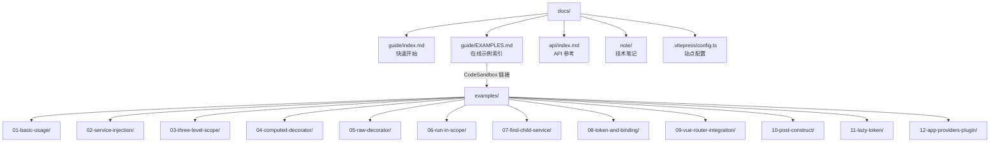

# 设计文档

## 概述

本设计文档描述 `@kaokei/use-vue-service` 4.0.0 版本的文档和示例代码重构方案。重构目标是使文档与当前源代码保持一致，补充缺失的 API 文档，创建覆盖核心功能的示例项目，并修正 VitePress 配置。

主要变更范围：
- **Guide 文档**：更新快速开始指南，移除过时的 `experimentalDecorators` 配置，补充新 API 介绍
- **API 文档**：新增 `@Raw`、`@RunInScope` 装饰器文档，更新 `@Computed` 文档，移除 `getEffectScope`，补充类型定义
- **Note 文档**：修正 `05.响应式方案.md` 和 `06.装饰器.md` 中的过时内容
- **VitePress 配置**：补充缺失的 sidebar 条目
- **Examples**：创建 12 个编号命名的独立示例项目，删除旧的 `demo1`
- **EXAMPLES 文档**：创建 CodeSandbox 在线示例索引页

## 架构

本次重构不涉及源代码变更，仅涉及文档和示例代码。整体架构如下：



## 组件与接口

### 1. Guide 文档变更（docs/guide/index.md）

**变更内容：**

| 区域 | 当前状态 | 目标状态 |
|------|---------|---------|
| 装饰器配置 | 要求 `experimentalDecorators: true` | 说明使用 Stage 3 装饰器，无需额外配置 |
| `@Inject` 说明 | 未说明来源 | 说明来自 `@kaokei/di`，通过本库重新导出 |
| 核心 API 介绍 | 仅展示 `declareProviders` + `useService` | 补充三组 API 的简要介绍 |
| 装饰器介绍 | 无 | 补充 `@Computed`、`@Raw`、`@RunInScope` 简要介绍 |
| Token 常量 | 无 | 补充 `FIND_CHILD_SERVICE`、`FIND_CHILDREN_SERVICES` 介绍 |
| 版本信息 | 无 | 标注 4.0.0 版本，依赖 `@kaokei/di ^5.0.4` |

**文档结构：**

```markdown
# 快速开始
## 简介（含版本信息）
## 安装（更新装饰器配置说明）
## 基本使用（保留现有示例，修正导入说明）
## 三组核心 API
### 组件级：useService / declareProviders
### 全局根级：useRootService / declareRootProviders
### App 级：useAppService / declareAppProviders / declareAppProvidersPlugin
## 装饰器
### @Computed
### @Raw
### @RunInScope
## Token 常量
### FIND_CHILD_SERVICE
### FIND_CHILDREN_SERVICES
```

### 2. API 文档变更（docs/api/index.md）

**新增内容：**
- `@Raw` 装饰器完整文档（功能说明、`@Raw` 和 `@Raw()` 两种用法、field 和 auto-accessor 两种装饰目标、使用示例）
- `@RunInScope` 装饰器完整文档（功能说明、`@RunInScope` 和 `@RunInScope()` 两种用法、返回 EffectScope 行为、使用示例）
- 类型定义文档（`NewableProvider`、`FunctionProvider`、`Provider`、`FindChildService`、`FindChildrenServices`）

**更新内容：**
- `@Computed` 装饰器文档：补充 `@Computed` 和 `@Computed()` 两种用法、writable computed 支持、懒创建策略说明

**删除内容：**
- `getEffectScope` 的公开 API 文档（该函数不再从 index.ts 导出）

**文档结构：**

```markdown
# API 文档
## @kaokei/di（保留现有说明）
## 类型定义（新增）
### NewableProvider / FunctionProvider / Provider
### FindChildService / FindChildrenServices
## declareProviders（保留并确认一致）
## useService（保留并确认一致）
## declareRootProviders（保留并确认一致）
## useRootService（保留并确认一致）
## declareAppProviders（保留并确认一致）
## useAppService（保留并确认一致）
## declareAppProvidersPlugin（保留并确认一致）
## FIND_CHILD_SERVICE（保留并确认一致）
## FIND_CHILDREN_SERVICES（保留并确认一致）
## Computed（更新）
## Raw（新增）
## RunInScope（新增）
```

### 3. Note 文档变更

**05.响应式方案.md：**
- 修正 `@Computed` 示例代码，将 `@Computed` 应用于 getter 属性而非普通方法

当前错误示例：
```ts
@Computed
public nick() {
  return this.userInfo.value?.nickName;
}
```

修正为：
```ts
@Computed
public get nick() {
  return this.userInfo?.nickName;
}
```

**06.装饰器.md：**
- 更新 MarkRaw 装饰器部分，说明 `@Raw` 装饰器已在 4.0.0 版本中实现
- 说明实现方式：基于 TC39 Stage 3 field/accessor 装饰器，不再需要与 `container.onActivation` 耦合
- 保留历史讨论内容作为参考，但明确标注已解决

**涉及 experimentalDecorators 的文件：**
- `13.Legacy-experimentalDecorators-装饰器类型详解.md` 作为历史参考保留，无需修改
- 其他文件中如有引用，需标注该配置已不再需要

### 4. VitePress 配置变更（docs/.vitepress/config.ts）

**Sidebar 变更：**

`/note/` sidebar 新增 5 个条目：
```ts
{ text: 'computed缓存陷阱', link: '/note/11.computed缓存陷阱' },
{ text: 'TC39-Stage3-装饰器类型详解', link: '/note/12.TC39-Stage3-装饰器类型详解' },
{ text: 'Legacy-experimentalDecorators-装饰器类型详解', link: '/note/13.Legacy-experimentalDecorators-装饰器类型详解' },
{ text: 'Computed装饰器只适用于getter属性', link: '/note/14.Computed装饰器只适用于getter属性' },
{ text: 'computed-comparison', link: '/note/15.computed-comparison' },
```

新增 `/guide/` sidebar：
```ts
'/guide/': [
  {
    text: 'Guide',
    items: [
      { text: '快速开始', link: '/guide/' },
      { text: 'CodeSandbox 在线示例', link: '/guide/EXAMPLES' },
    ],
  },
],
```

新增 `/api/` sidebar：
```ts
'/api/': [
  {
    text: 'API',
    items: [
      { text: 'API 文档', link: '/api/' },
    ],
  },
],
```

### 5. 示例项目规划（examples/）

#### 通用模板

每个示例目录的标准结构：

```
examples/<编号>-<名称>/
├── .codesandbox/
│   └── tasks.json
├── src/
│   ├── main.ts
│   ├── App.vue
│   └── ... (业务文件)
├── index.html
├── package.json
├── tsconfig.json
└── vite.config.ts
```

**通用 .codesandbox/tasks.json：**
```json
{
  "setupTasks": [
    {
      "name": "Installing Dependencies",
      "command": "pnpm install"
    }
  ],
  "tasks": {
    "start": {
      "name": "start",
      "command": "pnpm start",
      "runAtStart": true,
      "preview": {
        "port": 5173
      }
    }
  }
}
```

**通用 package.json 模板：**
```json
{
  "name": "use-vue-service-example-<编号>-<名称>",
  "version": "1.0.0",
  "description": "<中文描述>",
  "type": "module",
  "scripts": {
    "start": "vite"
  },
  "dependencies": {
    "@kaokei/di": "^5.0.0",
    "@kaokei/use-vue-service": "^4.0.0",
    "vue": "^3.5.13"
  },
  "devDependencies": {
    "@vitejs/plugin-vue": "^6.0.0",
    "vite": "^6.0.0"
  }
}
```

**通用 tsconfig.json：**
```json
{
  "compilerOptions": {
    "target": "ES2022",
    "module": "ESNext",
    "moduleResolution": "bundler",
    "strict": true,
    "useDefineForClassFields": true,
    "jsx": "preserve",
    "noEmit": true
  }
}
```

**通用 vite.config.ts：**
```ts
import { defineConfig } from 'vite';
import vue from '@vitejs/plugin-vue';

export default defineConfig({
  plugins: [vue()],
});
```

**通用 index.html：**
```html
<!DOCTYPE html>
<html lang="zh-CN">
  <head>
    <meta charset="UTF-8" />
    <meta name="viewport" content="width=device-width, initial-scale=1.0" />
    <title><编号>-<名称> - use-vue-service</title>
  </head>
  <body>
    <div id="app"></div>
    <script type="module" src="src/main.ts"></script>
  </body>
</html>
```

**通用 src/main.ts：**
```ts
import { createApp } from 'vue';
import App from './App.vue';

createApp(App).mount('#app');
```

#### 12 个示例详细规划

**01-basic-usage** — 基本用法：declareProviders + useService
- description: "基本用法：declareProviders 声明服务、useService 获取服务实例"
- 演示：定义 CountService 和 LoggerService，在组件中声明和使用
- 参考：现有 demo1 + test1

**02-service-injection** — 服务间依赖注入：@Inject
- description: "服务间依赖注入：使用 @Inject 装饰器注入依赖服务"
- 演示：ServiceA 通过 @Inject 注入 ServiceB，展示自动依赖解析
- 参考：test3

**03-three-level-scope** — 三层级服务作用域
- description: "三层级服务作用域：组件级、App 级、全局根级服务的声明与获取"
- 演示：分别使用 declareProviders/declareAppProviders/declareRootProviders 声明服务，展示三层级容器关系
- 参考：test7
- 额外依赖：无

**04-computed-decorator** — @Computed 装饰器
- description: "@Computed 装饰器：将 getter 属性转换为 Vue computed 响应式计算属性"
- 演示：展示 @Computed 和 @Computed() 两种用法，展示缓存效果，展示 writable computed
- 参考：test20、demo1

**05-raw-decorator** — @Raw 装饰器
- description: "@Raw 装饰器：标记属性不参与 Vue 响应式追踪"
- 演示：展示 @Raw 和 @Raw() 两种用法，展示 field 和 auto-accessor 两种装饰目标
- 参考：raw 测试

**06-run-in-scope** — @RunInScope 装饰器
- description: "@RunInScope 装饰器：在 EffectScope 中运行方法，自动管理副作用生命周期"
- 演示：展示 @RunInScope 装饰方法，在方法中使用 watchEffect，展示 scope.stop() 清理
- 参考：effect-scope 测试

**07-find-child-service** — FIND_CHILD_SERVICE / FIND_CHILDREN_SERVICES
- description: "父组件获取子组件服务：FIND_CHILD_SERVICE 和 FIND_CHILDREN_SERVICES"
- 演示：父组件通过 FIND_CHILD_SERVICE 获取子组件声明的服务实例
- 参考：test19

**08-token-and-binding** — Token 系统与自定义绑定
- description: "Token 系统与自定义绑定：Token 实例、FunctionProvider、toDynamicValue"
- 演示：使用 Token 作为标识符，使用 FunctionProvider 进行自定义绑定
- 参考：test5、test6

**09-vue-router-integration** — Vue Router 集成
- description: "Vue Router 集成：在路由组件中使用依赖注入服务"
- 演示：结合 vue-router，在不同路由页面中声明和使用服务
- 参考：test11
- 额外依赖：`"vue-router": "^4.5.0"`

**10-post-construct** — @PostConstruct 生命周期
- description: "@PostConstruct 生命周期：服务实例化后自动执行初始化方法"
- 演示：使用 @PostConstruct 装饰器在服务创建后执行初始化逻辑
- 参考：test1

**11-lazy-token** — LazyToken 解决循环依赖
- description: "LazyToken 解决循环依赖：使用 LazyToken 延迟解析避免循环引用"
- 演示：两个服务互相依赖，通过 LazyToken 解决循环依赖问题
- 参考：test18

**12-app-providers-plugin** — App 级服务插件
- description: "App 级服务插件：使用 declareAppProvidersPlugin 以 Vue 插件形式声明服务"
- 演示：通过 app.use(declareAppProvidersPlugin([...])) 声明 App 级服务
- 参考：test9

### 6. EXAMPLES 文档（docs/guide/EXAMPLES.md）

参照 `di` 项目的 `docs/guide/EXAMPLES.md` 格式，创建索引页面。

URL 格式：`https://codesandbox.io/p/sandbox/github/kaokei/use-vue-service/tree/main/examples/<示例目录>`

### 7. 旧示例清理

删除 `examples/demo1/` 目录。其功能（declareProviders + useService + @Computed）已被 `01-basic-usage` 和 `04-computed-decorator` 覆盖。

## 数据模型

本次重构不涉及数据模型变更。所有变更均为文档文件和示例代码文件。

**文件变更清单：**

| 操作 | 文件路径 | 说明 |
|------|---------|------|
| 修改 | `docs/guide/index.md` | 更新快速开始指南 |
| 修改 | `docs/api/index.md` | 更新 API 文档 |
| 修改 | `docs/note/05.响应式方案.md` | 修正 @Computed 示例 |
| 修改 | `docs/note/06.装饰器.md` | 更新 @Raw 装饰器说明 |
| 修改 | `docs/.vitepress/config.ts` | 补充 sidebar 配置 |
| 新增 | `docs/guide/EXAMPLES.md` | CodeSandbox 在线示例索引 |
| 新增 | `examples/01-basic-usage/` | 基本用法示例 |
| 新增 | `examples/02-service-injection/` | 服务间依赖注入示例 |
| 新增 | `examples/03-three-level-scope/` | 三层级服务作用域示例 |
| 新增 | `examples/04-computed-decorator/` | @Computed 装饰器示例 |
| 新增 | `examples/05-raw-decorator/` | @Raw 装饰器示例 |
| 新增 | `examples/06-run-in-scope/` | @RunInScope 装饰器示例 |
| 新增 | `examples/07-find-child-service/` | 父组件获取子组件服务示例 |
| 新增 | `examples/08-token-and-binding/` | Token 系统与自定义绑定示例 |
| 新增 | `examples/09-vue-router-integration/` | Vue Router 集成示例 |
| 新增 | `examples/10-post-construct/` | @PostConstruct 生命周期示例 |
| 新增 | `examples/11-lazy-token/` | LazyToken 解决循环依赖示例 |
| 新增 | `examples/12-app-providers-plugin/` | App 级服务插件示例 |
| 删除 | `examples/demo1/` | 旧示例（功能已被新示例覆盖） |


## 正确性属性

*正确性属性是在系统所有有效执行中都应成立的特征或行为——本质上是关于系统应该做什么的形式化陈述。属性是人类可读规范与机器可验证正确性保证之间的桥梁。*

### 属性 1：示例目录结构与配置完整性

*对于任意*示例目录，该目录应包含以下必需文件：`.codesandbox/tasks.json`、`index.html`、`package.json`、`tsconfig.json`、`vite.config.ts`、`src/` 目录；其中 `vite.config.ts` 应导入并使用 `@vitejs/plugin-vue` 插件；`.codesandbox/tasks.json` 应配置 `setupTasks` 包含 `pnpm install`，`tasks.start` 包含 `pnpm start` 且 `runAtStart` 为 `true`。

**验证：需求 5.1、5.5、5.6**

### 属性 2：示例 package.json 规范性

*对于任意*示例的 `package.json`，`dependencies` 中应包含 `@kaokei/di: ^5.0.0`、`@kaokei/use-vue-service: ^4.0.0`、`vue: ^3.5.13`；`devDependencies` 中应包含 `@vitejs/plugin-vue: ^6.0.0`、`vite: ^6.0.0`；`description` 字段应存在且为非空中文描述。

**验证：需求 5.2、7.2**

### 属性 3：示例 tsconfig.json 统一配置

*对于任意*示例的 `tsconfig.json`，`compilerOptions` 应包含 `target: "ES2022"`、`module: "ESNext"`、`moduleResolution: "bundler"`、`strict: true`、`useDefineForClassFields: true`、`jsx: "preserve"`、`noEmit: true`。

**验证：需求 7.3**

### 属性 4：EXAMPLES 文档 CodeSandbox 链接格式正确性

*对于* EXAMPLES 文档中列出的*任意* CodeSandbox 链接，其 URL 应匹配格式 `https://codesandbox.io/p/sandbox/github/kaokei/use-vue-service/tree/main/examples/<示例目录>`，且 `<示例目录>` 应对应 `examples/` 下实际存在的目录名。

**验证：需求 6.3**

## 错误处理

本次重构为文档和示例代码变更，不涉及运行时错误处理逻辑。

需要注意的潜在问题：
- **示例依赖版本**：`package.json` 中使用 `^` 范围版本号，确保 CodeSandbox 能安装到兼容版本
- **Vue Router 示例**：`09-vue-router-integration` 额外依赖 `vue-router`，需在 `package.json` 中声明
- **CodeSandbox 兼容性**：确保 `.codesandbox/tasks.json` 配置正确，`pnpm install` 和 `pnpm start` 能正常执行

## 测试策略

### 属性测试（Property-Based Testing）

使用 `fast-check`（项目已安装）进行属性测试，每个属性测试至少运行 100 次迭代。

| 属性 | 测试方法 | 标签 |
|------|---------|------|
| 属性 1：示例目录结构与配置完整性 | 遍历所有示例目录，验证必需文件存在性和配置内容 | Feature: docs-and-examples-refactor, Property 1: 示例目录结构与配置完整性 |
| 属性 2：示例 package.json 规范性 | 读取所有示例的 package.json，验证版本号和 description | Feature: docs-and-examples-refactor, Property 2: 示例 package.json 规范性 |
| 属性 3：示例 tsconfig.json 统一配置 | 读取所有示例的 tsconfig.json，验证编译选项 | Feature: docs-and-examples-refactor, Property 3: 示例 tsconfig.json 统一配置 |
| 属性 4：EXAMPLES 文档链接格式 | 解析 EXAMPLES.md 中的链接，验证 URL 格式和目录存在性 | Feature: docs-and-examples-refactor, Property 4: EXAMPLES 文档 CodeSandbox 链接格式正确性 |

**说明**：由于本次重构主要是文档和配置文件的变更，属性测试的输入空间是有限的（示例目录集合）。属性测试的价值在于确保所有示例目录的一致性——当新增或修改示例时，测试能自动验证所有示例都符合规范。生成器将从实际的 `examples/` 目录中随机选取示例目录作为输入。

### 单元测试（Example-Based）

| 测试项 | 验证内容 |
|--------|---------|
| Guide 文档内容 | 不包含 `experimentalDecorators: true` 配置要求；包含 Stage 3 装饰器说明；包含三组 API 介绍；包含三个装饰器介绍；包含版本信息 |
| API 文档内容 | 包含 @Raw、@RunInScope 完整文档；@Computed 文档已更新；不包含 getEffectScope 公开 API；包含类型定义文档 |
| Note 文档内容 | 06.装饰器.md 包含 @Raw 已实现说明；05.响应式方案.md 中 @Computed 使用 getter 语法 |
| VitePress 配置 | /note/ sidebar 包含 11-15 号条目；/guide/ sidebar 包含快速开始和 EXAMPLES；/api/ sidebar 包含 API 文档 |
| EXAMPLES 文档 | 文件存在；包含表格；包含独立性说明 |
| 旧示例清理 | examples/demo1/ 不存在 |

### 集成测试

| 测试项 | 验证内容 |
|--------|---------|
| 示例可运行性 | 在每个示例目录中执行 `pnpm install` 验证依赖安装成功 |
| VitePress 构建 | 执行 `pnpm docs:build` 验证文档站点构建成功 |
