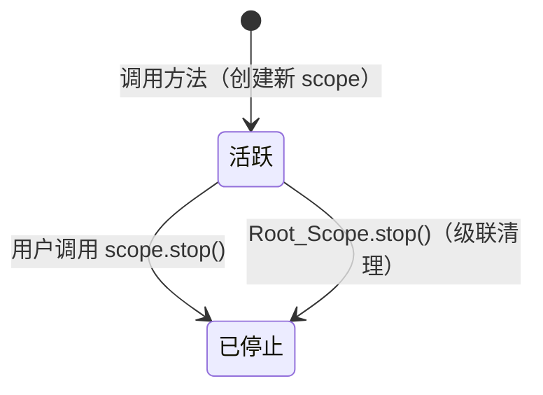

# 设计文档：@EffectScope 方法装饰器

## 概述

`@EffectScope` 是一个 TC39 Stage 3 方法装饰器，为 `@kaokei/use-vue-service` 库提供方法级别的副作用作用域管理能力。它作为 `getEffectScope(this).run(() => {...})` 的语法糖，允许开发者在被装饰的方法内部自由使用 Vue 的 `computed`、`watch`、`watchEffect` 等响应式 API，副作用会被自动收集到独立的 Child_Scope 中。

与现有的 `@Computed` 装饰器（使用 Root_Scope）不同，`@EffectScope` 为每个被装饰的方法创建独立的 Child_Scope，支持按方法粒度重置副作用，实现"定义与执行分离"的设计理念。

### 设计决策与理由

1. **Child_Scope 而非 Root_Scope**：`@EffectScope` 在 Root_Scope 内创建 Child_Scope，而非直接使用 Root_Scope。这样 `scope.stop()` 只清理该方法的副作用，不影响 `@Computed` 等使用 Root_Scope 的功能。Vue 的 EffectScope 父子关系保证了 Root_Scope 被 stop 时会级联清理所有 Child_Scope。

2. **返回 Child_Scope 而非方法返回值**：被装饰方法返回 Child_Scope 实例，方便用户通过 `scope.stop()` 重置副作用。TypeScript 类型约束被装饰方法必须返回 `void`，因为 `@EffectScope` 内部主要使用 `watch`/`watchEffect`（computed 应使用 `@Computed` 装饰器）。

3. **每次调用创建新 Child_Scope**：每次调用被装饰方法都会创建一个新的 Child_Scope 并返回。装饰器内部不维护任何状态映射，由用户自行持有和管理返回的 Child_Scope。这使得实现极其简洁，同时给予用户完全的控制权。

4. **累加语义的本质**：由于每次调用都创建新的 Child_Scope，多次调用自然产生多个独立的 Child_Scope，副作用分布在不同的 scope 中。用户可以选择性地 stop 某个 scope 来重置对应调用产生的副作用，也可以通过 Root_Scope 的 stop 一次性清理所有。

5. **双调用风格**：与 `@Computed` 和 `@Raw` 保持一致，同时支持 `@EffectScope` 和 `@EffectScope()` 两种调用风格。

## 架构

### 整体架构

```mermaid
graph TD
    subgraph 实例生命周期
        A[DI Container 创建实例] --> B[reactive 包裹实例]
        B --> C[用户主动调用 @EffectScope 方法]
        C --> D[在 Child_Scope.run 中执行方法体]
        D --> E[返回 Child_Scope]
        E --> F{用户操作}
        F -->|再次调用方法| D
        F -->|scope.stop| G[清理该方法副作用]
        G -->|再次调用方法| H[创建新 Child_Scope]
        H --> D
    end

    subgraph Scope 层级
        RS[Root_Scope<br/>getEffectScope 创建] --> CS1[Child_Scope A<br/>@EffectScope 方法 A]
        RS --> CS2[Child_Scope B<br/>@EffectScope 方法 B]
        RS --> CR[ComputedRef<br/>@Computed getter]
    end
```

### Scope 层级关系

```
Root_Scope (实例级，SCOPE_KEY)
├── @Computed getter 的 computed() 副作用（直接在 Root_Scope 中）
├── Child_Scope_A (@EffectScope 方法 A)
│   ├── watch() 副作用
│   └── watchEffect() 副作用
└── Child_Scope_B (@EffectScope 方法 B)
    ├── watch() 副作用
    └── watchEffect() 副作用
```

### 关键流程

1. **装饰阶段**（类定义时）：`@EffectScope` 替换原始方法为包装方法
2. **调用阶段**（用户主动调用时）：
   - 获取或创建 Root_Scope（通过 `getEffectScope(this)`）
   - 创建新的 Child_Scope（`Root_Scope.run(() => effectScope())`）
   - 在 Child_Scope.run() 中执行原始方法体
   - 返回 Child_Scope 给用户
3. **清理阶段**：
   - 用户调用返回的 `scope.stop()` → 仅清理该次调用产生的副作用
   - DI 容器销毁实例 → `removeScope(obj)` → Root_Scope.stop() → 级联清理所有 Child_Scope

## 组件与接口

### 新增文件：`src/effect-scope.ts`

```typescript
import type { EffectScope as VueEffectScope } from 'vue';
import { effectScope } from 'vue';
import { getEffectScope } from './scope.ts';

/**
 * EffectScope 装饰器的实际实现
 * 
 * 每次调用被装饰方法时：
 * 1. 获取或创建实例的 Root_Scope
 * 2. 在 Root_Scope 内创建新的 Child_Scope
 * 3. 在 Child_Scope.run() 中执行原始方法体
 * 4. 返回 Child_Scope 给用户
 * 
 * 装饰器内部不维护任何状态，Child_Scope 的生命周期完全由用户管理。
 * 
 * @param value - 原始方法
 * @param context - TC39 Stage 3 方法装饰器上下文
 * @returns 包装后的方法，返回 Child_Scope
 */
function effectScopeDecorator(
  value: (this: any, ...args: any[]) => void,
  context: ClassMethodDecoratorContext
): (this: any, ...args: any[]) => VueEffectScope {
  return function (this: any, ...args: any[]): VueEffectScope {
    const rootScope = getEffectScope(this);

    // 每次调用都创建新的 Child_Scope
    const childScope = rootScope.run(() => effectScope())!;

    // 在 Child_Scope 中执行原始方法体
    childScope.run(() => value.call(this, ...args));

    return childScope;
  };
}

// 类型：被装饰方法必须返回 void
type VoidMethod = (this: any, ...args: any[]) => void;

// 重载签名：支持 @EffectScope 和 @EffectScope() 两种用法
export function EffectScope(): (
  value: VoidMethod,
  context: ClassMethodDecoratorContext
) => (this: any, ...args: any[]) => VueEffectScope;
export function EffectScope(
  value: VoidMethod,
  context: ClassMethodDecoratorContext
): (this: any, ...args: any[]) => VueEffectScope;
export function EffectScope(
  value?: VoidMethod,
  context?: ClassMethodDecoratorContext
): any {
  // 不带括号：@EffectScope — 直接作为装饰器调用
  if (typeof value === 'function' && context?.kind === 'method') {
    return effectScopeDecorator(value, context);
  }
  // 带括号：@EffectScope() — 作为工厂函数调用，返回装饰器
  return effectScopeDecorator;
}
```

### 修改文件：`src/index.ts`

```typescript
// 新增导出
export { EffectScope } from './effect-scope.ts';

// 移除导出
// export { getEffectScope } from './scope.ts';  // 删除此行
```

### 接口说明

| 接口 | 类型 | 说明 |
|------|------|------|
| `EffectScope()` | 工厂函数 | 返回方法装饰器，`@EffectScope()` 用法 |
| `EffectScope` | 直接装饰器 | `@EffectScope` 用法（不带括号） |
| 被装饰方法签名 | `(...args: any[]) => void` | 方法必须返回 void |
| 被装饰方法调用返回值 | `VueEffectScope` | 返回 Child_Scope 实例 |

### 与现有组件的关系

| 组件 | 关系 | 说明 |
|------|------|------|
| `scope.ts` | 依赖 | 使用 `getEffectScope()` 获取/创建 Root_Scope |
| `computed.ts` | 隔离 | 两者使用不同层级的 scope，互不影响 |
| `create-container.ts` | 间接 | 通过 `removeScope` 的级联清理机制自动清理 |
| `constants.ts` | 无变更 | 不需要新增常量 |

## 数据模型

### 实例上的数据存储

```
实例对象 (raw)
└── [SCOPE_KEY]: EffectScope          // Root_Scope（已有，由 getEffectScope 管理）
    ├── Child_Scope_1                 // 第 1 次调用 @EffectScope 方法返回（用户持有）
    ├── Child_Scope_2                 // 第 2 次调用 @EffectScope 方法返回（用户持有）
    └── ...                           // 更多调用产生的 Child_Scope
```

装饰器内部不在实例上存储任何额外数据。所有 Child_Scope 通过 Vue EffectScope 的父子关系自动关联到 Root_Scope，由用户自行持有引用。

### Child_Scope 生命周期



每次调用方法都会创建一个全新的 Child_Scope，不存在"重建"的概念——用户只需再次调用方法即可获得新的 scope。

### 无额外数据结构

装饰器实现无状态，不使用 WeakMap、Symbol 或任何模块级数据结构。所有 Child_Scope 的管理完全依赖：
- Vue EffectScope 的父子关系（Root_Scope → Child_Scope）实现级联清理
- 用户自行持有返回的 Child_Scope 引用实现按需重置


## 正确性属性

*属性（Property）是指在系统所有合法执行中都应成立的特征或行为——本质上是对系统应做之事的形式化陈述。属性是连接人类可读规格说明与机器可验证正确性保证之间的桥梁。*

### 属性反思（Property Reflection）

对需求中的验收标准进行分析后，识别出以下冗余和合并机会：

- **1.1 + 1.2 + 2.2** 都是验证"方法体在 Child_Scope 中执行，副作用被收集"→ 合并为属性 1
- **3.1 + 3.2** 都是累加语义的不同表述 → 合并为属性 2
- **5.1 + 5.2 + 8.2** 都是关于 scope 隔离性 → 合并为属性 5
- **4.2 + 4.3 + 6.3** 是编译期类型约束，不适合属性测试
- **9.1 + 9.2 + 9.3** 是导出配置检查，属于 SMOKE 测试
- **7.2** 是架构约束，由 7.1 间接验证

### Property 1：副作用收集到 Child_Scope

*For any* 被 `@EffectScope` 装饰的方法，当该方法被调用且方法体内创建了任意数量的 `watchEffect` 副作用时，这些副作用都应被收集到该方法对应的 Child_Scope 中（即 `scope.effects` 的长度应等于创建的副作用数量）。

**Validates: Requirements 1.1, 1.2, 2.2**

### Property 2：每次调用返回新的 Child_Scope

*For any* 被 `@EffectScope` 装饰的方法和任意调用次数 N（N ≥ 2），每次调用都应返回一个新的 Child_Scope 实例（与之前返回的 scope 不是同一个对象），且每个 scope 都是活跃的。

**Validates: Requirements 3.1, 3.2, 5.3**

### Property 3：返回 Child_Scope 实例

*For any* 被 `@EffectScope` 装饰的方法的调用，返回值应为一个活跃的 Vue `EffectScope` 实例（具有 `active`、`run`、`stop` 属性，且 `active === true`）。

**Validates: Requirements 4.1**

### Property 4：实例化不自动执行

*For any* 包含 `@EffectScope` 装饰方法的类，实例化后被装饰的方法不应被自动调用（方法体执行次数为 0）。

**Validates: Requirements 2.1**

### Property 5：Scope 隔离性

*For any* 同时包含多个 `@EffectScope` 方法和 `@Computed` getter 的类实例，当某次 `@EffectScope` 方法调用返回的 Child_Scope 被 `stop()` 后，其他调用返回的 Child_Scope 应仍然活跃，且 `@Computed` 创建的 computed 属性应继续正常响应式更新。

**Validates: Requirements 5.1, 5.2, 8.1, 8.2**

### Property 6：Stop 不影响后续调用

*For any* 被 `@EffectScope` 装饰的方法，当之前返回的某个 Child_Scope 被 `stop()` 后，再次调用该方法时，应返回一个新的活跃 Child_Scope，且新 scope 能正常收集副作用。

**Validates: Requirements 5.3**

### Property 7：级联清理

*For any* 包含任意数量 `@EffectScope` 方法的类实例，当通过 `removeScope(obj)` 停止 Root_Scope 时，所有 Child_Scope 都应变为 inactive 状态。

**Validates: Requirements 7.1**

## 错误处理

| 场景 | 处理方式 |
|------|----------|
| 装饰非方法成员（getter/setter/field） | TypeScript 类型系统在编译期阻止，运行时通过重载签名的 `context.kind === 'method'` 检查 |
| 方法返回非 void 值 | TypeScript 类型约束在编译期报错，运行时忽略方法返回值 |
| 在 Child_Scope 被 stop 后访问 scope | Vue EffectScope 自身处理，`active` 属性为 `false`，用户再次调用方法会获得新的 scope |
| Root_Scope 不存在时调用方法 | `getEffectScope(this)` 会自动创建 Root_Scope，无需额外处理 |

## 测试策略

### 属性测试（Property-Based Tests）

本特性适合属性测试，因为：
- 核心逻辑是纯函数式的（装饰器转换、scope 管理）
- 存在明确的通用属性（副作用收集、累加语义、隔离性）
- 输入空间可变（副作用数量、调用次数、方法数量）

使用 `fast-check` 库（项目已有依赖），每个属性测试运行至少 100 次迭代。

每个属性测试必须包含注释引用设计文档中的属性：
- 标签格式：**Feature: effect-scope-decorator, Property {number}: {property_text}**

### 单元测试（Example-Based Tests）

| 测试场景 | 验证内容 | 对应需求 |
|----------|----------|----------|
| `@EffectScope` 不带括号用法 | 装饰器正确工作 | 6.1 |
| `@EffectScope()` 带括号用法 | 装饰器正确工作 | 6.2 |
| TypeScript 类型约束 | 非 void 方法编译报错 | 4.2, 4.3 |
| 与 `@Computed` 共存 | 两种装饰器互不影响 | 8.1 |

### 冒烟测试（Smoke Tests）

| 测试场景 | 验证内容 | 对应需求 |
|----------|----------|----------|
| `index.ts` 导出 `EffectScope` | 公共 API 可用 | 9.1 |
| `index.ts` 不导出 `getEffectScope` | API 变更生效 | 9.2 |
| `scope.ts` 保留 `getEffectScope` | 内部 API 可用 | 9.3 |

### 测试文件组织

```
tests/
└── effect-scope/
    ├── basic.test.ts          # 基础功能 + 调用风格
    ├── accumulation.test.ts   # 累加语义
    ├── isolation.test.ts      # scope 隔离性 + 与 @Computed 共存
    ├── lifecycle.test.ts      # stop/重建/级联清理
    └── export.test.ts         # 导出检查
```
