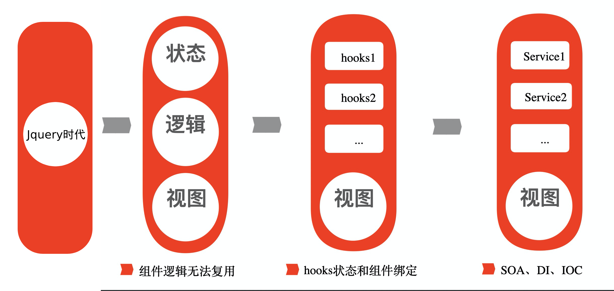

# 前端发展各个阶段

## 前端的 4 个阶段

前端发展大致可以分为 4 个阶段：jquery 阶段、组件阶段、hooks 阶段、服务阶段。

## jquery 阶段

jquery 时代，以及 jquery 之前的时代，是完全命令式的编程。没有模块化，没有工程化，只不过可以通过 jquery 实现跨浏览器的兼容性，以及基于 jquery 生态的插件化开发。

前端的主要工作一直都是保持数据和视图的一致性。在 jquery 时代，当用户点击了某个按钮，在监听事件中，我们需要自己做两件事：第一件事是根据用户点击行为修改内存中的某些数据；第二件事是根据修改后的数据，再次修改网页上的视图部分。

## 组件阶段

由上图可知组件自带状态和逻辑，当然还有视图。当我们定义好一个组件时，该组件是可以在多个地方使用的，这是组件在代码复用层面的优势。

组件的另一个优势则是响应式编程，又可以理解为数据驱动式编程。

在组件时代，我们不需要自己来保证数据和视图的一致性了。我们只需要修改数据即可，前端框架会帮我们保证数据和视图的一致性。也就是当数据修改了，页面视图部分会自动更新。

除了组件本身的优势以外，我们还可以借助 babel 来实现前端的模块化和工程化，从而提升开发体验以及效率。

## hooks 阶段

组件时代看起来已经很完美了，但是依然还是有缺陷的，就是组件和组件之间不能共享逻辑代码。

比如在 A 组件中有一个功能是展示当前用户的 name，已经可以编辑该 name。在另一个 B 组件中也有类似的功能。

在没有 hooks 之前，我们可能会把这个功能抽象成一个组件 `NameComponent`，然后分别在 A 组件和 B 组件中使用 `NameComponent` 即可。但是如果我们想要在 A 组件和 B 组件中的样式不一样，那么我们就需要给 `NameComponent` 增加 props，然后在 A 和 B 组件中分别传入不同的参数。

现在这样做是不够解耦的。逻辑的归逻辑，视图的归视图。我们可以利用 hooks 函数做到逻辑和视图彻底的解耦。

把状态和逻辑从组件中分离出来，主要依赖于 composition api，主要是封装成类似 react 中的 hooks 函数。这样的好处是，这个函数是可以在多个组件中复用的。

## 服务阶段

在 hooks 阶段中，组件已经和逻辑分离了，但是，还是强耦合的。

那么如何理解服务呢？其实从大体上来理解是非常简单的。hooks 就是服务的实例化，服务是 hooks 的抽象。实例化和抽象可以参考类的实例和类的关系。

从代码使用风格上来看，我们之前是直接在组件内调用 hooks 函数。现在我们是在组件内调用服务类来获取服务实例，也就是通过服务类来获取 hooks 实例。

以前是直接就使用 hooks 了，现在是通过中间的服务才能使用 hooks。所以说以前是强依赖 hooks 的，现在则是面向抽象编程、面向接口编程。

最关键的地方在于直接调用 hooks 函数，我们没有办法干预这个 hooks 执行的过程。但是通过服务来获取 hooks 的过程我们是可以干预的，从而实现以下这样的效果：

- 本来通过 `AService` 应该获取的是 `AService` 的实例，实际上通过配置可以对使用方透明的替换成 `BService` 的实例。
- 在以前 hooks 时代，hooks 执行后，hooks 的状态是一定和当前组件强制绑定的。但是现在可以统一管理服务，服务的状态不是强制和当前组件绑定的，而是可以选择和某个组件绑定，并且在其他组件中也可以获取同一个服务实例，从而方便的实现跨组件通信。

回过头来看，可以清楚的看到 hooks 时代，组件是强制依赖 hooks 的，但是服务时代，则需要通过服务这个概念来间接的使用 hooks，从而可以方便的实现跨组件通信以及状态管理。

很久之前就看过一句话：react 和 vue 迟早有一天会变成 angular。
